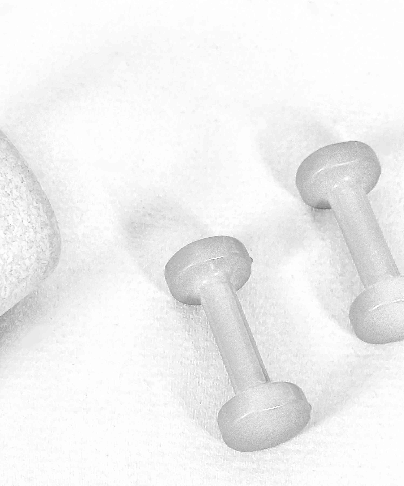

# Brittas Kurse

## Wirbelsäulengymnastik / Rückenfit

Termine

| Tag           | Zeit          |
| ------------- | ------------- |
| Mo            | 12:00 - 13:00 |
| Mi            | 18:00 - 19:00 |
| Sa            | 10:00 - 11:00 |

Wir führen eine Ausgleichsgymnastik der wirbelsäulenrelevanten Körperpartien (Rücken-/Bauchmuskulatur) durch.
